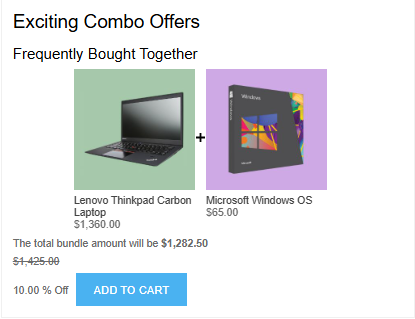
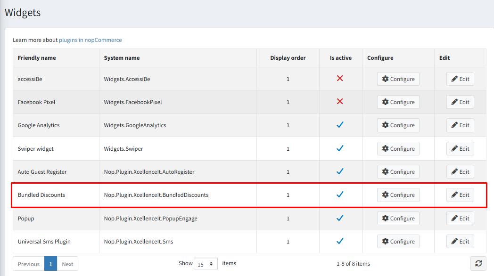

As shown in the image below, you can add a bundle to the cart by clicking **Add to Cart** for your selected bundle.

- You can add the same bundle to the cart multiple times.
- You can also add multiple different bundles to the cart in a single order.

{ .img-border }

When you click the **Add to Cart** button, if any product in the bundle has configurable attributes, a pop-up window will appear allowing you to select the required options.

[Attribute Pop-up](AttributePopup.md)

You can view the applied bundle discounts on the **Cart** and **Order Summary** pages.

[Bundle Discount Summary](BundleDiscountSummary.md)

If bundles are not visible on the product details page, please check:

- Products are added to the bundle.
- The bundle is set to **Active**.
- The **Bundled Discounts** widget is enabled, as shown in the image below.

{ .img-border }

If you still cannot see the bundle list on the product details page, please contact our support team. Refer to [How to get help](Help.md) for assistance.

[← Previous](Addbundledproducts.md) | [Next →](AttributePopup.md)