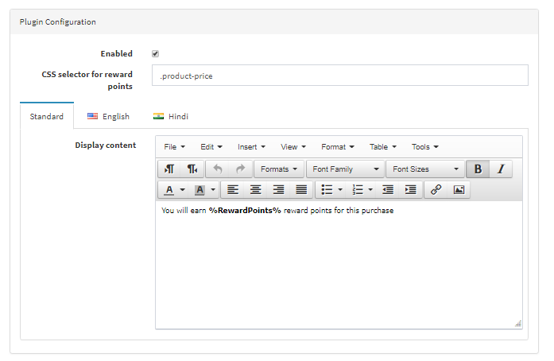

## General Tab Configuration

This plug-in displays **reward points** on the product detail page that a customer would earn based on the product amount and the configured reward point settings.

> ⚠️ **Note:** The plug-in will not work if reward points settings are disabled in nopCommerce.  
> To enable reward point settings, go to:  
> **Configuration → Settings → Reward Points**  
> and enable it along with other reward point configurations.

## Display Configuration
- You can choose where to display reward points for the product amount using **"CSS selector for Reward points"**.  
  Reward points will appear after the element defined by your selector.

- You can customize the HTML content with **inline CSS styles** in the **"Display content"** text box as per your preference.

> 💡 **Important:**  
> It is **mandatory** to include the keyword `RewardPoints` in your text where you want the calculated reward points to appear.  
> Without `RewardPoints`, only static text will be displayed on the product details page (no reward points will be shown).

[← Previous](Licence.md) | [Next →](senerioOfUse.md)