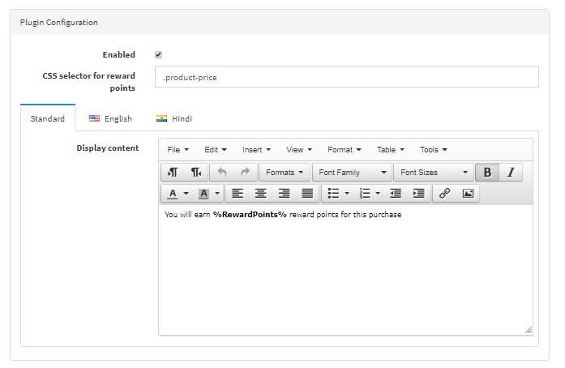

## Reward Points on Specific Date

This feature allows you to award reward points to customers on a selected promotional date.

Customers who place orders on the configured date will automatically receive additional reward points.

---

## Steps to Configure

### Step 1: Open Specific Date Settings

Navigate to:

**Admin → Display Reward Points → Specific Date**

Click **Add New**.

---

### Step 2: Configure the Settings

Configure the following fields:

#### Award Date
Select the date on which reward points should be awarded.

#### Reward Points
Enter the number of reward points to grant to customers.

#### Reward Points Validity
Specify how long the awarded reward points will remain valid.

#### Is Active
Enable or disable the reward rule.

#### Message
Customize the message displayed to customers using supported placeholders.

---

## Supported Placeholders

You can use the following keywords in the message:

```text
%RewardPoints%  → Displays reward points value
%date%          → Displays the selected promotional date
```

---

### Example Message

```html
Earn %RewardPoints% extra reward points on %date%!
```

---

## Save Configuration

Click **Save** to apply the configuration.

