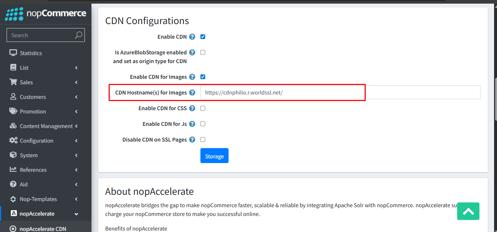

Genral Tab Configurations:

You need to configure plug-in in general tab as shown in the below figure.

**Enable CDN :** Checking this box activates the CDN integration for the store. If unchecked, all other settings below are ignored, and assets will be served directly from the application server.

**Is AzureBlobStorage enabled and set as origin type for CDN :** Check this only if you are storing your media files in Microsoft Azure Blob Storage and using it as the origin source for your CDN. This changes how file paths are generated to be compatible with Azure's container structure.

**Enable CDN for Images:** When checked, all product images, category icons, and uploaded media will be served from the CDN URL.

**CDN Hostname(s) for Images:** Enter the URL provided by your CDN provider 
**Note: In the screenshot, the value is set to http://demo.nopcommerce.com/. In a live production environment, this should be your actual CDN endpoint.**

**Enable CDN for Css:** When checked, the application's stylesheet files (.css) will be loaded from the CDN.

**CDN Hostname(s) for Css** Enter the CDN URL for stylesheets. This is usually the same as the image hostname, but can be different if you have a specific sharding strategy

**Enable CDN for Js:** When checked, the application's script files (.js) will be loaded from the CDN.

**CDN Hostname(s) for Js:** Enter the CDN URL for JavaScript files.

**Disable CDN on SSL Pages:** If your CDN provider does not support HTTPS (SSL), check this box. This ensures that when a user visits a secure page (like Checkout or Login), the assets are loaded from your secure server instead of the non-secure CDN to prevent "Mixed Content" security warnings in the browser.
 

[← Previous](License.md) 