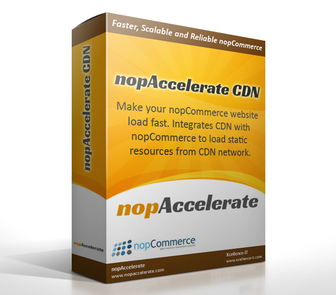

**CDN Plugin Overview**

Integrate your nopCommerce store with a Content Delivery Network (CDN) effortlessly using this nopCommerce CDN plugin. The nopAccelerate CDN Plugin removes the technical complexity of setting up a powerful CDN for your store.It works with any CDN provider that supports Pull Zone configuration.

Integrating a Content Delivery Network (CDN) into your website is one of the easiest and most cost-effective ways to improve web performance.nopAccelerate CDN Plugin supports several CDN service providers and makes integration with nopCommerce simple.

Your site will benefit from improved page load times by utilizing a CDN network to load static resources, while also significantly reducing server load.

## What is CDN (Content Delivery Network)?

A CDN (Content Delivery Network) is a globally distributed network of servers that delivers web content quickly to users by duplicating the content on multiple servers and directing the content to users based on proximity.

In other words, a CDN is simply a network of servers around the globe. A CDN’s primary purpose is to deliver content to users in the fastest possible way.

## Benefits of Using a CDN

- Faster page load times
- Faster delivery of static content  
- Lower network latency and packet loss  
- Higher availability  
- Decreased server load  
- Reduced bandwidth usage  

[Next →](Feature.md)