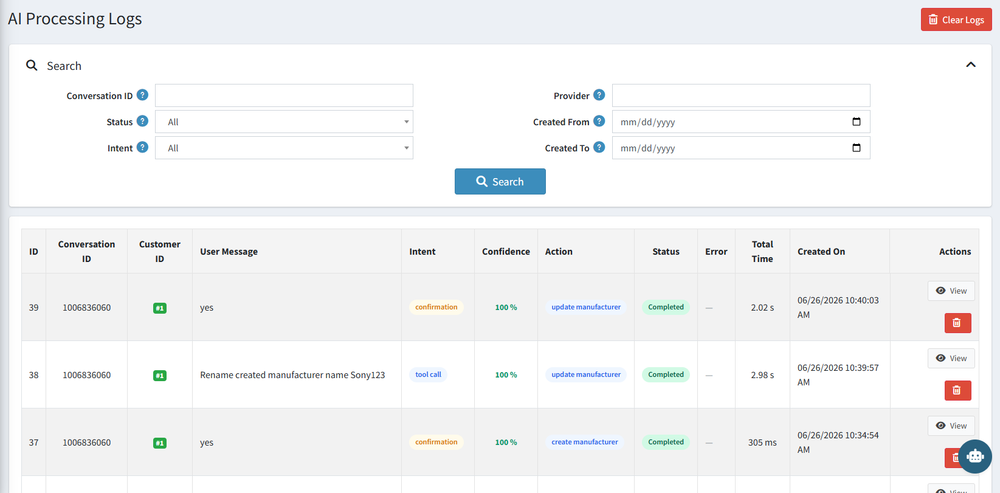

# AI Processing Logs

The **AI Processing Logs** page shows a detailed record of every message the AI has processed. Use it to monitor bot activity, check response accuracy, and diagnose any issues.

{ .img-border }

## Search and Filter Options

| **Filter**            | **Description**                                                              |
|-----------------------|------------------------------------------------------------------------------|
| **Conversation ID**   | Filter logs for a specific conversation.                                     |
| **Provider**          | Filter by the AI model provider used.                                        |
| **Status**            | Filter by outcome — All, Completed, or Error.                                |
| **Intent**            | Filter by the type of request detected (e.g. tool call, confirmation).       |
| **Created From / To** | Filter logs by a specific date range.                                        |
| **Clear Logs**        | Permanently deletes all log entries. **Use with caution.**                   |

## Log List Columns

| **Column**          | **Description**                                                                                       |
|---------------------|-------------------------------------------------------------------------------------------------------|
| **ID**              | Unique log entry number.                                                                              |
| **Conversation ID** | Links the entry to a specific chat session.                                                           |
| **Customer ID**     | The admin user who sent the message.                                                                  |
| **User Message**    | The exact message typed by the user.                                                                  |
| **Intent**          | What the AI understood the request to be (e.g. `tool call`, `confirmation`, `general`).              |
| **Confidence**      | How certain the AI was about its interpretation, shown as a percentage.                               |
| **Action**          | The specific tool or action the AI executed (e.g. `update manufacturer`, `create manufacturer`).     |
| **Status**          | Outcome of the request — **Completed** (green) or **Error** (red).                                   |
| **Error**           | Error detail if the request failed.                                                                   |
| **Total Time**      | How long it took to generate and execute the response.                                                |
| **Created On**      | Date and time the message was processed.                                                              |
| **Actions**         | **View** to see full log detail, or delete the entry.                                                 |

[← Previous](knowledge-base.md) | [Next →](help.md)
