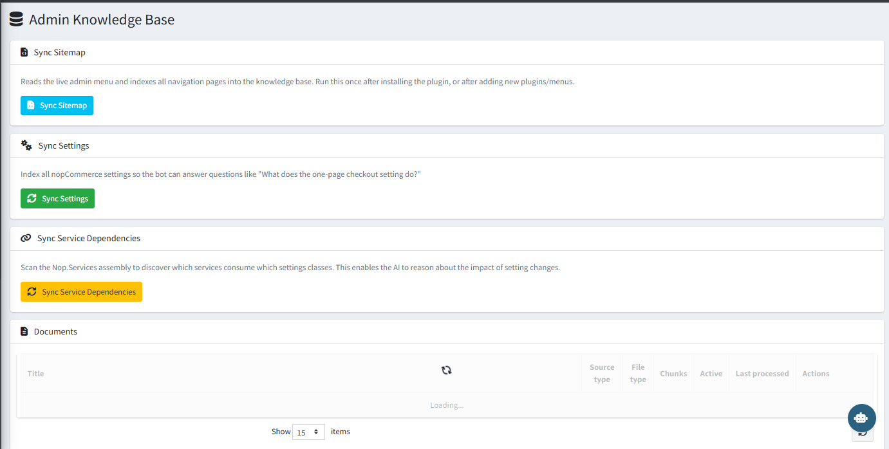

# Admin Knowledge Base

The **Admin Knowledge Base** is the information source the AI uses to answer questions about your store's admin pages, settings, and service dependencies. It is indexed automatically when the plugin is installed and can be refreshed manually at any time.

{ .img-border }

## Sync Options

| **Action**                    | **What It Does**                                                                                                                    |
|-------------------------------|-------------------------------------------------------------------------------------------------------------------------------------|
| **Sync Sitemap**              | Reads the live admin menu and indexes all navigation pages into the knowledge base. Run once after installation or after adding new plugins or menus. |
| **Sync Settings**             | Indexes all nopCommerce settings so the AI can answer questions like *"What does the one-page checkout setting do?"*                |
| **Sync Service Dependencies** | Scans the Nop.Services assembly to discover which services consume which settings classes. Enables the AI to reason about the impact of setting changes. |

## Documents

The Documents section lists all indexed knowledge base entries, showing their source type, file type, chunk count, active status, last processed date, and available actions.

> **Tip:** Run **Sync Sitemap** and **Sync Settings** immediately after installation. Re-sync whenever you install additional plugins or change your store structure.

[← Previous](registered-tools.md) | [Next →](ai-processing-logs.md)