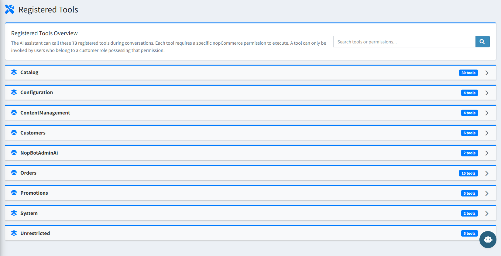

# Registered Tools

The **Registered Tools** page shows every store management command the AI can execute on your behalf. Each tool maps to a specific nopCommerce permission and is only available to users whose role holds that permission.

{ .img-border }

There are **73 registered tools** across the following categories:

| **Category**         | **Tools** | **Examples**                                                                          |
|----------------------|-----------|---------------------------------------------------------------------------------------|
| Catalog              | 30        | Add product attributes, adjust stock, approve reviews, assign categories, create manufacturers |
| Orders               | 15        | Add order notes, create shipments, approve returns, update order status, process refunds, void orders |
| Customers            | 6         | Update customer details, adjust reward points, manage roles                           |
| Promotions           | 5         | Create discounts, gift cards, email campaigns                                         |
| ContentManagement    | 4         | Create and update topic pages (About Us, Shipping Policy, etc.)                       |
| Configuration        | 4         | Update store settings, clear cache, configure tax rates, toggle payment methods       |
| System               | 2         | Send emails, system-level actions                                                     |
| NopBotAdminAi        | 2         | Plugin-specific internal tools                                                        |
| Unrestricted         | 5         | Navigation, help, and general information commands                                    |

> **Tip:** Use the **Search tools or permissions** box at the top of the page to quickly find a specific tool by name or permission string.

## How Tools Work

- Type a plain-English command in the AI chat (e.g. *"Rename manufacturer Sony123"*).
- The AI identifies the correct tool and asks for your confirmation before making any changes.
- Read-only actions (search, get, list) execute immediately. Write operations always require confirmation first.

[← Previous](settings.md) | [Next →](knowledge-base.md)
