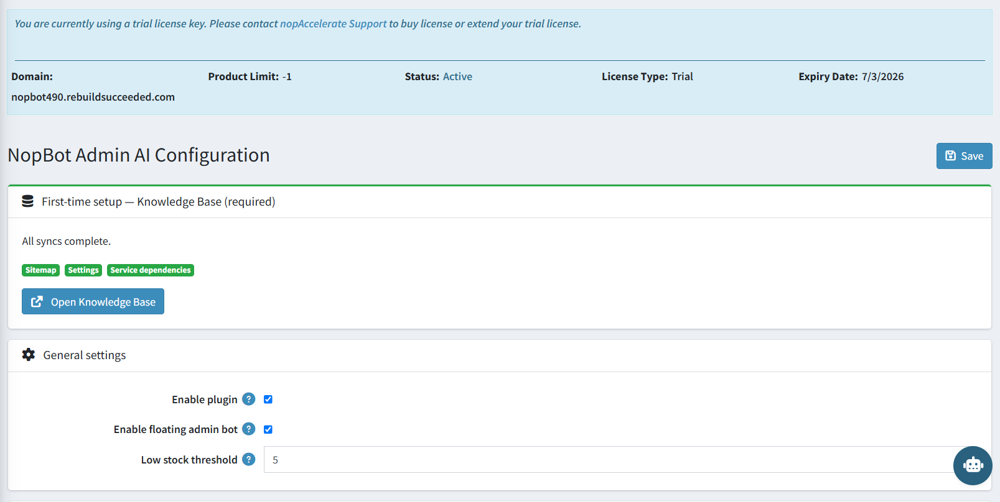
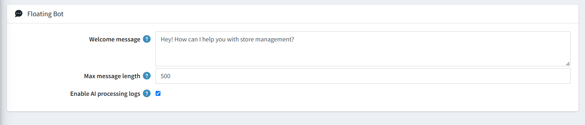

# Configuration

The **NopBot Admin AI Configuration** page controls the entire plugin. It is divided into three sections: First-time Setup, General Settings, Floating Bot, and OpenRouter Configuration.

## First-Time Setup — Knowledge Base (required)

When you open the configuration page for the first time, you will see a **Knowledge Base setup panel** at the top. This must be completed before the AI can answer questions accurately.

The panel shows the sync status of three required components:

| **Component**           | **What It Indexes**                                                                 |
|-------------------------|-------------------------------------------------------------------------------------|
| **Sitemap**             | All admin navigation pages so the AI knows where to direct you.                    |
| **Settings**            | All nopCommerce store settings so the AI can explain and update them.              |
| **Service Dependencies**| Which services consume which settings, enabling the AI to reason about side effects.|

Once all three are synced, the panel shows **"All syncs complete."** with green badges for each component. Click **Open Knowledge Base** to view or manage the indexed content.

{ .img-border }

## General Settings

| **Setting**                  | **Description**                                                                                       |
|------------------------------|-------------------------------------------------------------------------------------------------------|
| **Enable Plugin**            | Checked (ON) — Activates the plugin and the AI chat widget in the admin panel.                        |
| **Enable Floating Admin Bot**| Checked (ON) — Shows the floating chat button in the admin panel for quick AI access.                 |
| **Low Stock Threshold**      | `5` — Products with stock below this value are flagged as low stock in AI responses.                  |

## Floating Bot

| **Setting**                  | **Description**                                                                                       |
|------------------------------|-------------------------------------------------------------------------------------------------------|
| **Welcome Message**          | `Hey! How can I help you with store management?` — The first message shown when the chat is opened.   |
| **Max Message Length**       | `500` — Maximum number of characters a user can type in a single message.                             |
| **Enable AI Processing Logs**| Checked (ON) — Records every AI interaction to the [AI Processing Logs](ai-processing-logs.md) page. |

{ .img-border }

## OpenRouter Configuration

These settings connect the plugin to the OpenRouter AI service that powers all chat responses.

| **Setting**      | **Description**                                                                                                                 |
|------------------|---------------------------------------------------------------------------------------------------------------------------------|
| **API Key**      | Your secret OpenRouter API key. Required for the AI to function.                                                                |
| **AI Model**     | `google/gemini-3.1-flash-lite` — The AI model used to generate all responses.                                                   |
| **API Base URL** | `https://openrouter.ai/api/v1/chat/completions` — The OpenRouter service endpoint. Leave unchanged unless instructed otherwise. |

> **Note:** After entering your API key and model, click **Save** in the top-right corner. The plugin will begin connecting to OpenRouter immediately.

[← Previous](licence.md) | [Next →](registered-tools.md)
