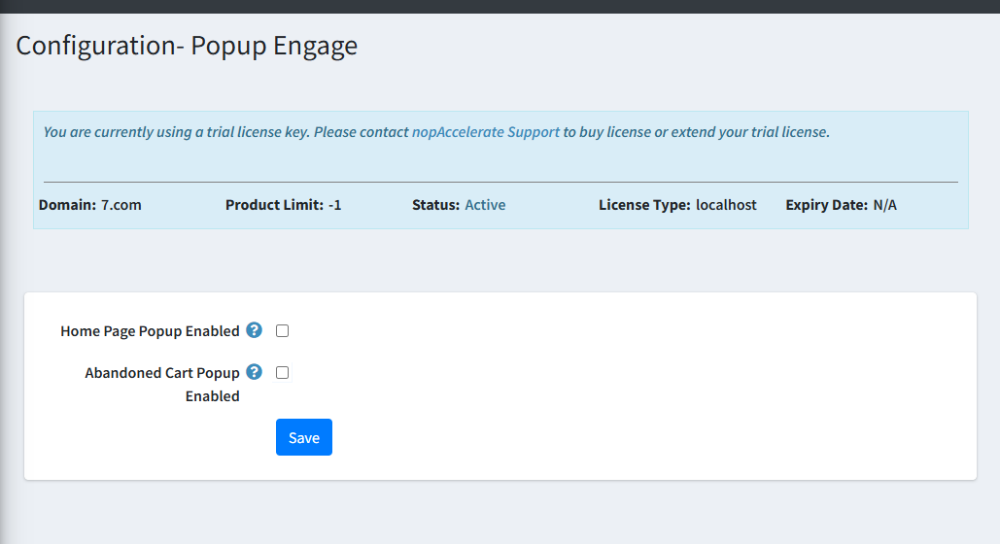
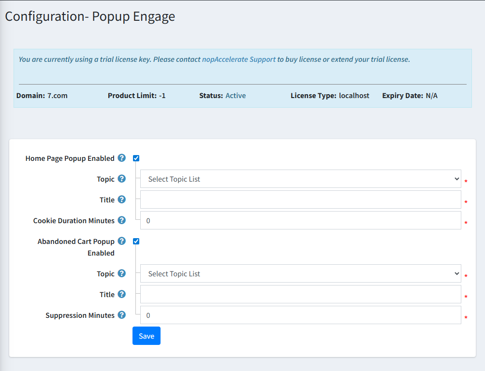

## 1. **Enable the Plugin**
- Before using any feature, make sure the plugin is enabled.  
- The popup functionalities will not work unless the plugin is turned on.

---

## 2. **Home Page Popup Settings**
These settings control the popup that appears when a customer visits the homepage.

- **Home Page Popup Enabled :** Enable this option to display a popup on the homepage.

- **Topic :**  Select a topic from the dropdown.  
- The selected topic’s content will appear inside the popup.

- **Title :** Enter the title text you want to show on the popup.

- **Cookie Duration Minutes:**  Define how long (in minutes) the popup should remain suppressed after it is shown.

- **Examples:** 
 - `0` → shows every time  
 - `1440` → once per day  
 - `43200` → once per month  

- **Behavior**
- Displays the popup using the configured topic and title.
- Works for both logged-in and guest users.

---

## 3. **Abandoned Cart Popup Settings**
These settings control the popup shown when a user is about to leave the website with items in the cart (exit-intent popup).

- **Abandoned Cart Popup Enabled :**  Enable this option to activate the exit-intent popup for abandoned carts.

- **Topic :** Choose a topic whose content will appear inside the popup.

- **Title :** Enter a title for the abandoned cart popup.

- **Suppression Minutes :** Set how long the popup should stay suppressed once it has appeared.  
- This prevents it from showing repeatedly in a short time.

- **Behavior**
- Detects when a user is about to leave the store while having items in the cart.
- **If the visitor is not logged in:** The popup shows the topic content along with an email subscription option.
- **If the visitor is logged in:**   Only the topic content is displayed.
---

## 4. **Saving Settings**
After adjusting all configurations, click **Save** to apply your changes.

[← Previous](Licence.md) | [Next →](senerioOfUse.md)