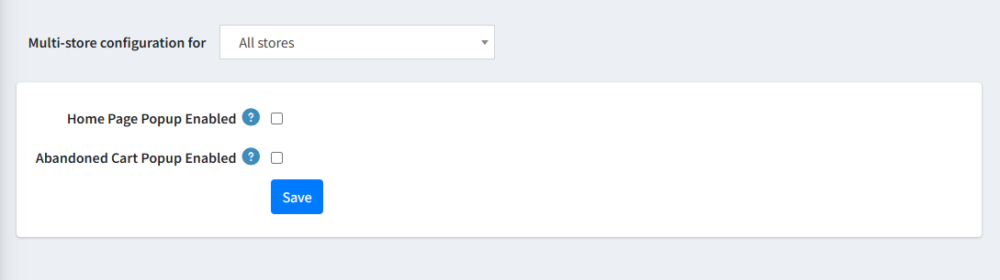
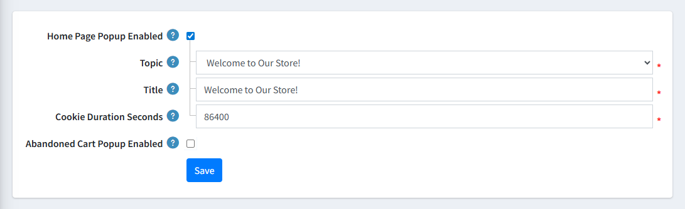

# Configuration

This guide explains how to configure the **Popup Engage** plugin to get the best results for your store.

## Multi-Store Configuration

- **Multi-store configuration for:**  
  If you run multiple stores, select the store you want to configure from the dropdown list.

  

---

## Home Page Popup Settings

These settings control the popup that appears when a customer visits your **Home page**.

- **Home Page Popup Enabled :** Enable this option to display the popup on the Home page.

- **Topic :** Select a standard **nopCommerce Topic** from the dropdown. The selected topic content (text, images, or HTML) will be displayed inside the popup.

- **Title :** Enter the heading text shown at the top of the popup. *(e.g., “Welcome!” or “Special Offer”).*

- **Cookie Duration (Seconds):** Defines how long the popup remains hidden after a user sees it, helping avoid overexposure:
    - **0** = Shows every time the page loads
    - **86400** = Shows once per day (24 hours)
    - **2592000** = Shows once per month (30 days)

---

## Abandoned Cart Popup Settings

These settings control the **Exit-Intent (Abandoned Cart) popup**, which appears when a customer tries to leave the site with items still in their cart.

.png)

- **Abandoned Cart Popup Enabled :** Enable this option to activate the exit-intent popup.

- **Topic :** Select the topic whose content will be displayed inside the abandoned cart popup.

- **Title :** Enter the heading text for the popup *(e.g., “Item left in your cart”).*

- **Suppression Seconds :** Set how long the popup should stay hidden after it appears once. This prevents it from showing repeatedly within a short time.

- **Smart Behavior**
    - **Guest Users:** The popup includes an email subscription field to collect leads.  
    - **Logged-in Users:** The email field is hidden, and only the offer or message is shown.

----

## Saving Your Changes

- After making your changes, click **Save** to apply them immediately.

[← Previous](Licence.md) | [Next →](senerioOfUse.md)