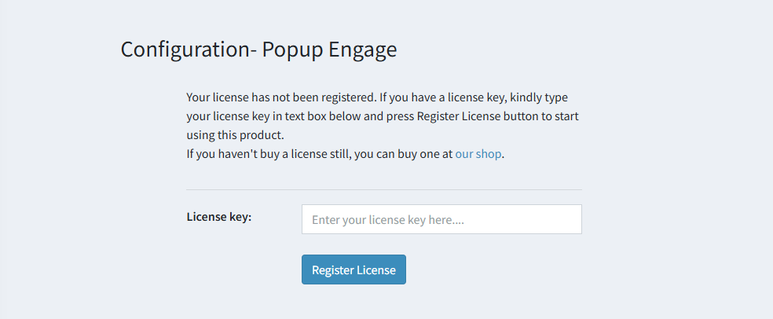

# Licensing

- After the site restarts, navigate to **nopAccelerate → Popup Engage → Configure** from the admin menu.
- Open the configuration page. it will prompt you to enter the **License Key**.
- Enter the unique License Key you received in your purchase confirmation email.
- Click the **Register License** button. 
- You are now ready to start using **Popup Engage**!

{ .img-border }

[← Previous](InstallationGuide.md) | [Next →](Configuration.md)