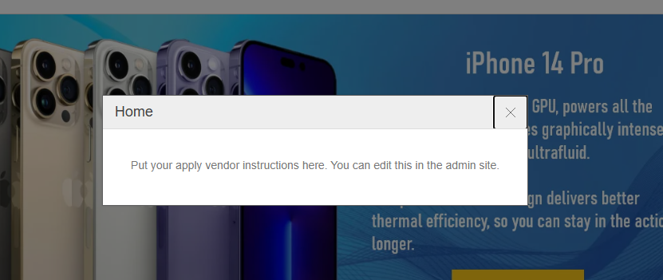

**Popup Engage** is used to engage users on the store at key moments.  
The plugin currently supports **two scenarios**:

---

## 1. **Home Page Popup**

This popup appears when a customer visits the **home page**.

### Key Features
- Displays any **Topic content** selected on the Configure page.
- Shows the configured **Title** and selected **Topic** content.
- Behavior is the same for **guest and logged-in** customers.
- **No newsletter subscription** is shown on the home page popup.

---

## 2. **Abandoned Cart (Exit-Intent) Popup**

This popup helps recover abandoned carts.  
It is shown when a customer has items in the cart and attempts to **leave the site** (exit-intent).

### Key Features
- Displays any **Topic content** selected on the Configure page.
- Shows the configured **Title** and selected **Topic** content.
- Behavior for **logged-in** customers popup Only see the **Title** and **Topic** content. .
- Behavior for **Guest Customers** customers popup Show the **Title** and **Topic** content with **Newsletter subscription option**

[← Previous](Configuration.md) | [Next →](Help.md)