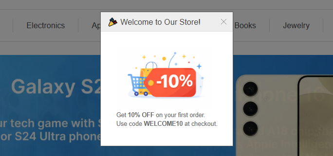
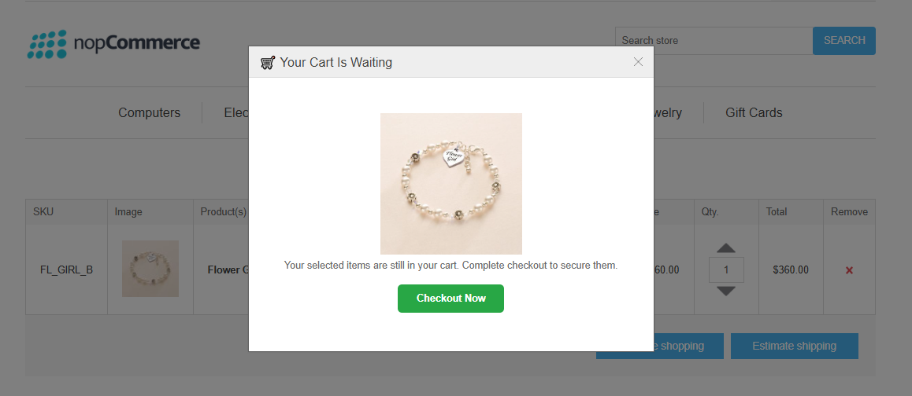
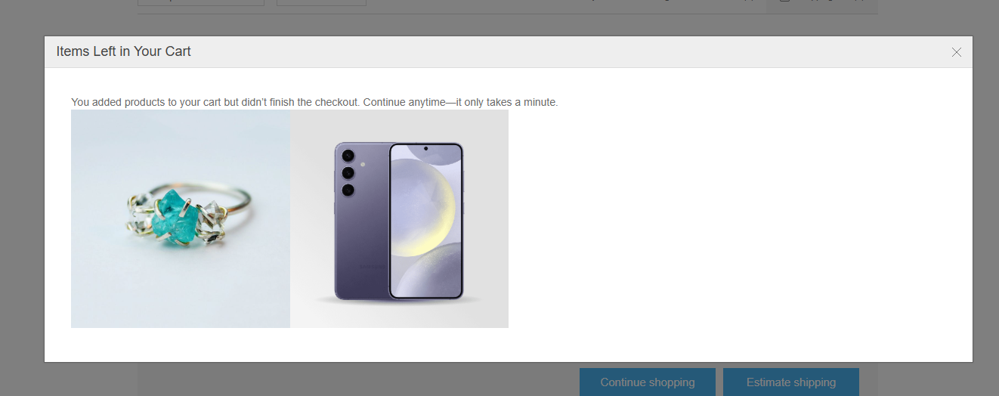

# Real-World Scenarios of Use

## Home Page Popup 

**Goal:** Engage visitors the moment they arrive. This popup triggers automatically when a customer lands on your **Home Page**. It’s ideal for announcements, welcome discounts, or flash sale alerts.

**Key Behavior:**

- **Instant Visibility :** Appears immediately to grab attention.
- **Dynamic Content :** Displays the specific **Topic** selected in settings (image, text, or video).
- **Distraction-Free :** Unlike other popups, the Home Page popup does **not** show a newsletter subscription form. The focus stays 100% on your announcement.

---

## Abandoned Cart Popup 

**Goal:** Recover lost revenue before a customer leaves. This intelligent popup triggers only when a customer has items in their cart and attempts to close the tab or browser window (**Exit-Intent**).

**Key Behavior:**

- **Smart Trigger :** Detects mouse movement toward the browser’s close button.
- **Context-Aware :** Identifies the user type and decides what content to show.

**How It Adapts to Different Users**

- **Guest Users**  
    - **What they see :** Message + Newsletter Form  
    - **Why :** Since the user is unknown, the popup includes a subscription form to capture their email as a lead—even if they don’t complete the purchase.

- **Logged-in Customers**  
    - **What they see :** Message only (No Form)  
    - **Why :** The email is already known, so the form is hidden. The popup focuses purely on the offer (e.g., *“Use code SAVE10”*) to help them complete checkout faster.

[← Previous](Configuration.md) | [Next →](Help.md)